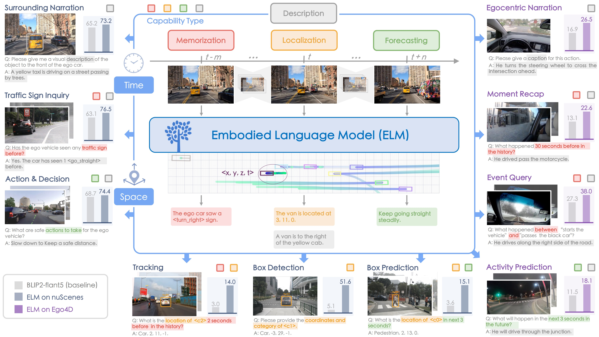
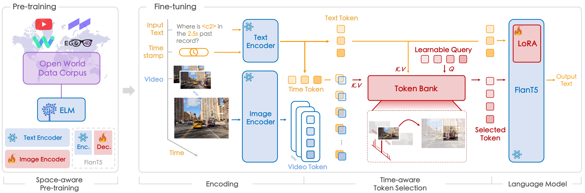

<div id="top" align="center">

# ELM: Embodied Understanding of Driving Scenarios

**Revive driving scene understanding by delving into the embodiment philosophy**

<a href="https://arxiv.org/abs/2308.10531">"></a>
<a href="/docs/dataset_stats.md">
  
</a>
<a href="#license-and-citation">
  
</a>



</div>

>
> [Yunsong Zhou](https://zhouyunsong-sjtu.github.io/), Linyan Huang, [Qingwen Bu](https://github.com/retsuh-bqw), Jia Zeng, Tianyu Li, Hang Qiu, Hongzi Zhu, Minyi Guo, Yu Qiao, and [Hongyang Li](https://lihongyang.info/)
> 
> - Presented by [OpenDriveLab](https://opendrivelab.com/) and Shanghai AI Lab
> - :mailbox_with_mail: Primary contact: [Yunsong Zhou]((https://zhouyunsong-sjtu.github.io/)) ( zhouyunsong2017@gmail.com ) 
> - [arXiv paper](https://arxiv.org/abs/2403.04593) | [Blog TODO]() | [Slides TODO]()
> - [CVPR 2024 Autonomous Deiving Challenge - Driving with Language](https://opendrivelab.com/challenge2024/)


## Highlights <a name="highlights"></a>

:fire: The first **embodied language model** for understanding the long-horizon driving scenarios in `space` and `time`. 

:star2: **ELM** expands a wide spectrum of new tasks to fully leverage the capability of large language models in an embodiment setting and achieves significant improvements in various applications.



:trophy: Interpretable driving model, on the basis of language prompting, will be a main track in the `CVPR 2024 Autonomous Driving Challenge`. Please [stay tuned](https://opendrivelab.com/challenge2024/) for further details!

## News <a name="news"></a>

- :fire: Interpretable driving model is launched. Please refer to the [link](https://opendrivelab.com/challenge2024/) for more details.
- `[2024/03]` ELM [paper](https://arxiv.org/abs/2403.04593) released.
- `[2024/03]` ELM code and data initially released.

## Table of Contents

1. [Highlights](#highlights)
2. [News](#news)
3. [TODO List](#todo)
4. [Installation](#installation)
5. [Dataset](#dataset)
6. [Training and Inference](#training)
7. [License and Citation](#license-and-citation)
8. [Related Resources](#resources)

## TODO List <a name="todo"></a>

- [x] Release fine-tuning code and data
- [ ] Release reference checkpoints
- [ ] Toolkit for label generation

## Installation <a name="installation"></a>

1. (Optional) Creating conda environment

```bash
conda create -n elm python=3.8
conda activate elm
```

2. install from [PyPI](https://pypi.org/project/salesforce-lavis/)
```bash
pip install salesforce-lavis
```
    
3. Or, for development, you may build from source

```bash
git clone https://github.com/OpenDriveLab/ELM.git
cd ELM
pip install -e .
```

## Dataset <a name="dataset"></a>


**Pre-training data.** We collect driving videos from YouTube, nuScenes, Waymo, and Ego4D. 
Here we provide a sample of 🔗 [YouTube video list](https://docs.google.com/spreadsheets/d/1HV-zOO6bh1sKjimhM1ZBcxWqPxgbalE3FDGyh2UHwPw/edit?usp=sharing) we used.
For privacy considerations, we are temporarily keeping the complete data labels private.

**Fine-tuning data.** 
The full set of question and answer pairs for the benchmark can be obtained through this 🔗[data link](https://drive.google.com/drive/folders/1QFBIrKqxjn9lfv31XMC3wVIdaAbpMwDL?usp=sharing). You may need to download the corresponding image data from the official [nuScenes](https://www.nuscenes.org/download) and [Ego4D](https://ego4d-data.org/#download) channels. 
For a `quick verification` of the pipeline, we recommend downloading the subset dataset of [DriveLM](https://github.com/OpenDriveLab/DriveLM/blob/main/docs/data_prep_nus.md) and organizing the data in line with the format.

Please make sure to soft link `nuScenes` and `ego4d` datasets under `data/xx` folder.
You may need to run `tools/video_clip_processor.py` to pre-process data first.
Besides, we provide some script used during auto-labeling, you may use these as a reference if you want to customize data.


## Training <a name="training"></a>
```bash
# you can modify the lavis/projects/blip2/train/advqa_t5_elm.yaml
bash scripts/train.sh
```

## Inference
Modify the  [advqa_t5_elm.yaml](lavis/projects/blip2/train/advqa_t5_elm.yaml#L71) to enable the evaluate as True.
```bash
bash scripts/train.sh
```
For the evaluation of generated answers, please use the script in `scripts/qa_eval.py`.
```bash
python scripts/qa_eval.py <data_root> <log_name>
```


## License and Citation

All assets and code in this repository are under the [Apache 2.0 license](./LICENSE) unless specified otherwise. The language data is under [CC BY-NC-SA 4.0](https://creativecommons.org/licenses/by-nc-sa/4.0/). Other datasets (including nuScenes and Ego4D) inherit their own distribution licenses. Please consider citing our paper and project if they help your research.

```BibTeX
@article{zhou2024elm,
  title={Embodied Understanding of Driving Scenarios},
  author={Zhou, Yunsong and Huang, Linyan and Bu, Qingwen and Zeng, Jia and Li, Tianyu and Qiu, Hang and Zhu, Hongzi and Guo, Minyi and Qiao, Yu and Li, Hongyang},
  journal={arXiv preprint arXiv:2403.04593},
  year={2024}
}
```

## Related Resources <a name="resources"></a>

We acknowledge all the open-source contributors for the following projects to make this work possible:

- [Lavis](https://github.com/salesforce/LAVIS) | [DriveLM](https://github.com/OpenDriveLab/DriveLM)


<a href="https://twitter.com/OpenDriveLab" target="_blank">
    
  </a>

- [DriveAGI](https://github.com/OpenDriveLab/DriveAGI) | [Survey on BEV Perception](https://github.com/OpenDriveLab/BEVPerception-Survey-Recipe) | [Survey on E2EAD](https://github.com/OpenDriveLab/End-to-end-Autonomous-Driving)
- [UniAD](https://github.com/OpenDriveLab/UniAD) | [OpenLane-V2](https://github.com/OpenDriveLab/OpenLane-V2) | [OccNet](https://github.com/OpenDriveLab/OccNet) | [OpenScene](https://github.com/OpenDriveLab/OpenScene)

